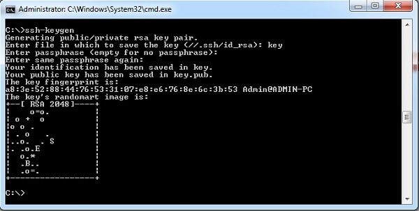
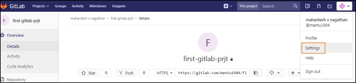
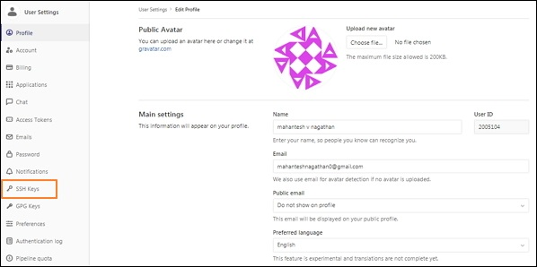
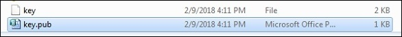
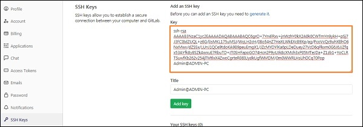
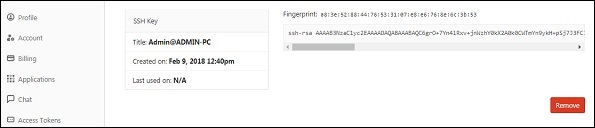

# Gitlab ssh key ayarları

>Cmd veya git bash üzerinden **ssh-keygen** komutu çalıştırılır

>Gitlab hesabınıza giriş yaptıktan sonra ayarlar seçeneğine tıklanır

>Sol tarafa menüde yer alan ssh keys kısmına tıklanır

>Şimdi ise **.pub** uzantılı oluşna dosya komu açılır

>Şimdi ise .pub uzantılı dosyayı açıp dosya içeriğini gitlab da key kısmına kopyalanır.

>Son olarak **add key** butonuna tıklanır ve işlem bitmiş olur.

